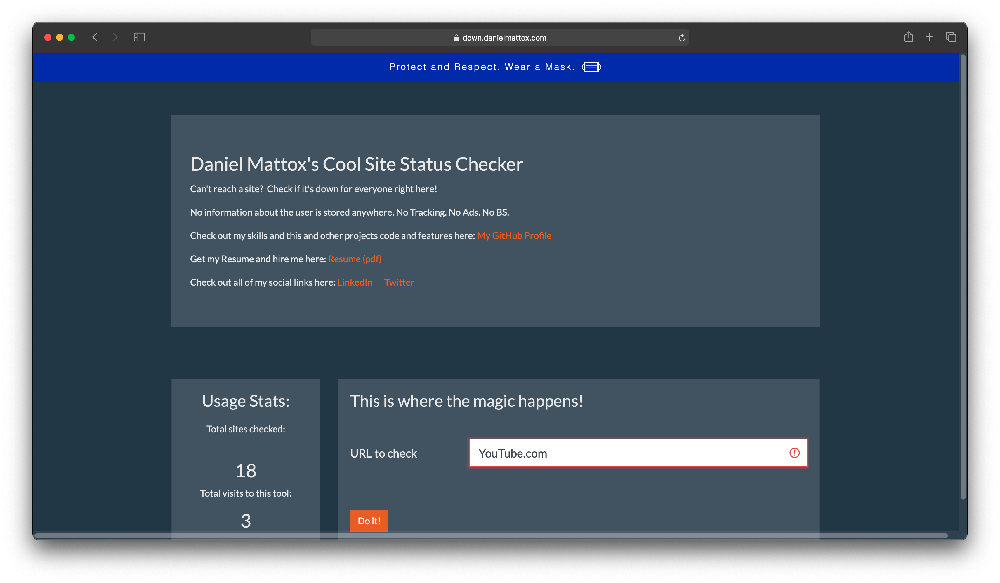
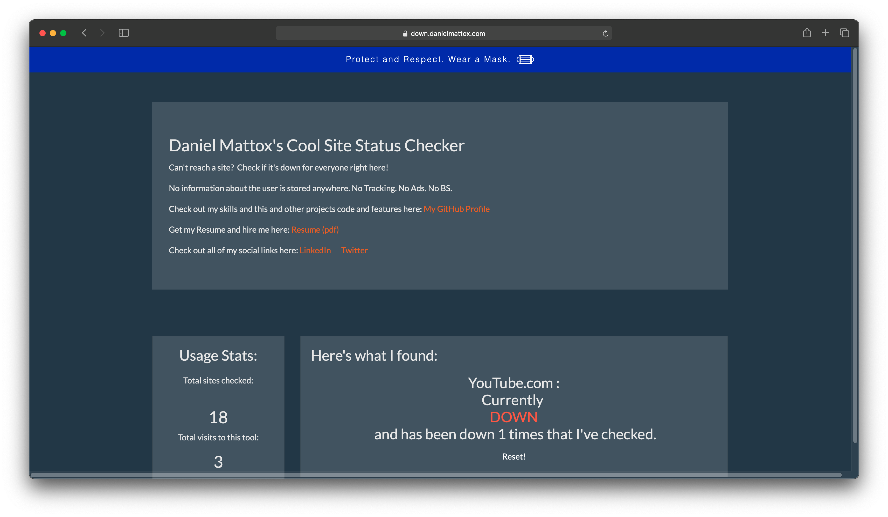
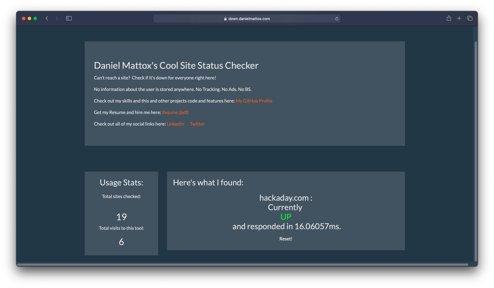

# IsItDown
A simple status checker for sites, servers, services, with uptime and overall stats on this service.

## About this project
A simple iteration of isitdownrightnow.com, with the stats interface I've been adding to all of my projects.

### Tech Stack
React web client, running in Docker, connects to Express server, running in Docker, uses MongoDB for persistence, running in Docker (kind of a theme for me).

#### Front End
React, react-router-dom to make it an SPA.

Axios - API calls

Formik and Yup - Form handling and validation

Reactstrap - Bootstrap wrapped in React components

Bootswatch - great styles in a hurry

#### Back End
Express - All the routes

Express-Brute - prevent abuse

LowDB - holds on to the site stats

Cron - Runs the checker on every entry in the DB once an hour

Is-Reachable - Tests whether or not a site responds

Res-Time - Gives me a ping time in ms

#### Todo
I need to show the user the 429 if they are submitting too often, and fix the fact that sites that are new to the DB require you to click on "Do It!" twice.

### Screenshots

This project is hosted on my private server [HERE CLICK ME!](https://down.danielmattox.com)